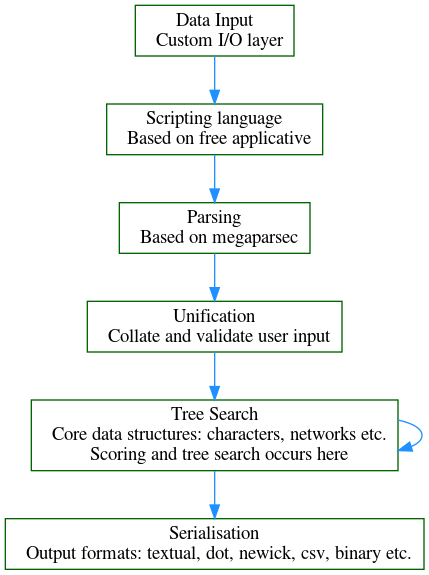

<!-- .slide: data-background="#134EA2" -->

##  Phylogenetic Software     in Haskell 

 Callan McGill, Alex Washburn   
 Ward Wheeler 

---

### Today's Talk:

 *   What is phylogenetics? 

 *  Organisation of our project 

 *  Who are the software users? 

 *  Challenges of Haskell 

---

### What is phylogenetics?

 The phylogenetic tree of emoji parrots 

----

 *   <b> Taxon set </b> :  emoji parrots
  

   
     <i> More generally: </i> Groups of organisms
     , languages, etc.
   
  

 *  <b> Character observations </b> :   colour of feathers

   
     <i>More generally: </i> Other morphological characteristics
     , DNA characters etc.
   <i> Note </i>: Characters have some notion of "metric" or transition cost.
   
  

 *  <b> Binary tree </b> :    hypothesized evolutionary tree of emoji parrots. 
  

   
    <i> More generally: </i> The <i> "best" </i> (see next slide) tree 
   to explain the relationships between these data. 
   
  

----

### Problems of phylogenetics

 <b>  Tree Alignment Problem (TAP) :  </b>   Given a tree and a set of characters, find an extension of those characters to the internal nodes in the tree which is minimal amongst all such extensions. <i> Minimality </i> here means reducing the overall transition cost over the entire tree. 

----

### Remarks:

 
<ul>
  <li> For characters with a discrete number of states such as DNA bases (<b> A-C-G-T </b>) there are well-known algorithms (<b>Fitch </b>) to solve this problem efficiently. </li>
  <li> For more general characters such as DNA sequences (<b> variable length strings of base pairs</b>), this is NP-hard. </li>
</ul>
  

----

### Problems of phylogenetics (Cont.)

 <b>  Generalized Tree Alignment Problem (GTAP) :  </b>   Among all possible trees and all possible extensions find those which minimize the overall cost. 

  (This is extra NP-hard.) 

---

### Our project: Phylogenetic Component Graph (PCG)

 *  Completely available at:   
     
      
 https://github.com/amnh/PCG 

 *  Code statistics: 

 <table style="width:5%" "height:5%">
  <tr>
    <th>Language</th>
    <th>Files</th>
    <th>Lines</th>
    <th>Code</th>
  </tr>
  <tr>
    <td>Haskell</td>
    <td>380</td>
    <td>64210</td>
    <td>37225</td>
  </tr>
  <tr>
    <td>C</td>
    <td>34</td>
    <td>23378</td>
    <td>14578</td>
  </tr>
  <tr>
    <td>C++</td>
    <td>4</td>
    <td>887</td>
    <td>533</td>
  </tr>
</table> 

----

### Project Layout

 

----

###  PCG Novel Phylogenetic Features

 *   Taxa are completely general. 

 *   Characters are also unconstrained and intended to be extensible to new types of characters. 

 *   The system allows Networks (<i> see next slide </i>), rather than just binary trees. 

----

 

 Schematic Phylogenetic Network 

---

### Phylogenetic user story

 *   Define taxa 

 *   Collect & colate character observations 

 *   Define your search parameters 

 *  Start your search 

----

### Mechanically this looks like

 *  Create a lot of large files

 *  Set a lot of configuration options 

 *  Wait a very long time

---

### Error Handling

 Don't stop at the first error, collect all the errors in a given <i> phase </i>: 

    data  ErrorPhase
        = Inputing  -- ^ Cannot get information off the disk
        | Parsing   -- ^ Cannot understand the information
        | Unifying  -- ^ Collectively incoherent information
        | Computing -- ^ We messed up, our bad
        | Outputing -- ^ Cannot write out information to disk

----

### Error Handling 

 Collect errors using `validation` package:  

<section><pre><code data-trim data-noescape>
    type
    
    data Either b a     = Left b    | Right a

    data Validation e a = Failure e | Success a
</code></pre></section>

    instance Applicative (Either b) where
        Right f <\*> r = fmap f r
        Left  e <\*> _ = Left e

    instance Semigroup e => Applicative (Validation e) where
        Success f  <\*> r = fmap f r
        Failure e1 <\*> b = Failure $ case b of
          Failure e2 -> e1 <> e2
          Success \_ -> e1

----

### I/O Errors

 Use a custom semigroup for I/O errors 

    newtype InputError = InputError (NonEmpty InputErrorMessage)
      deriving Semigroup

    data InputErrorMessage = 
          FileAlreadyInUse   FileSource
        | FileAmbiguous      FileSource (NonEmpty FileSource)
        | FileBadPermissions FileSource
        | FileEmptyStream    FileSource
        | FileUnfindable     FileSource

----

  <b> Uninformative stock I/O exception message: </b> 

<pre>
Exception: Could not open file 'parrots.fasta'
</pre>

  <b> Informative tailored I/O error message </b> 

<pre>
The file 'parrots.fasta' is already in use.

The following files do not exist:
  cryptozoology/big-foot.fasta
  cryptozoology/dragon.fasta
  cryptozoology/loch-ness.fasta
  cryptozoology/unicorn.fasta
  cryptozoology/yeti.fasta

The file 'void.data' was empty.

The following files have permissions which prevent them from being
opened:
  hidden.log
  secret.txt
</pre>

</section>

---

### Parse Errors

 *   Parse errors need to be informative too! 

 *  Share the parsing context with the user 

 *  We do this using the `megaparsec` package 

 

----

<section>

 <b> Uninformative stock parse error message </b> 

    <pre>
parrots.fasta+284:3375
Unexpected 'Q'
    </pre>

 <b> Informative customized parse error message </b> 

    <pre>
Parse error in 'parrots.fasta'
Line 284, column 3375:
  In the taxon 'Apple-Parrot-Emoji',
    In the 33rd line of sequence data
      Unexpected DNA nucleotide 'Q'
      Expected 'A', 'C', 'G', 'T', '-', or a DNA IUPAC code
    </pre>

</section>

---

### Other challenges

 *  Memory pressure: A typical phylogenetic example might have ~10^5 leaves (taxa) and ~10^7 observations. 

 *   Efficient data structures: Certain data structures are hard to implement (<i> more later </i>) or not implemented in the Haskell ecosystem. For example we currently uses constant-time access hashmaps from C++ (though we eventually plan to move this into Haskell)  

----

 *  FFI black box witchcraft: Linker GHC panics! Space leaks from C! Ahhhh! 

 *  String and I/O woes: We use Pipes to do file streaming, LazyText and ShortText for string representations and TextShow for both debugging and user representations. 

----

 *  Lack of row polymorphism: We make heavy use of lenses and the following idiom:

<pre class="hljs" style="display: block; overflow-x: auto; padding: 0.5em; background: rgb(39, 40, 34) none repeat scroll 0% 0%; color: rgb(221, 221, 221);">data Foo a b = Foo
  { fieldOne :: a
  , fieldTwo :: b
  }

class HasFieldOne s t a b  | s -&gt; a, t -&gt; b, s b -&gt; t, t a -&gt; s where
  _fieldOne :: Lens s t a b

instance HasFieldOne (Foo a b) (Foo a' b) a a'
  _fieldOne = lens fieldOne (\r f -&gt; r {fieldOne = f})</pre>

---

### Example: Graph representation:

 <i> Things we want from our graph representation: </i> 

 *   The graphs we allow are (roughly) rooted networks (<i> as depicted earlier </i>). 

 *  Fast look-up on nodes. 

 *  Ability to work with subgraphs. 
 
 *   Ability to traverse from leaf to root and from root to leaf in linear time. This is similar to a doubly linked tree. This rules out representations in terms of Binary trees or rose trees or etc. 

----

### Currently how this (roughly) looks

   <i> NB: This is about to be re-designed. </i> 

<section>
	<pre><code data-trim data-noescape>
data Graph = Vector (IndexData e n)

data IndexData e n = IndexData
  { nodeLabel  :: n
  , childRefs  :: IntMap e
  , parentRefs :: IntSet 
  }
	</code></pre>
</section>

  This leads to a lot of problems with index errors and also with memoized traversals. 

----

### Memoized single-pass traversals

 In order to do single traversals (à la beautiful folds):

<section>
	<pre><code data-trim data-noescape>

newtype MemoVector a = MemoVector (Endo (Int -> a))

 generateMemo :: forall a
  .  Int           -- ^ Range of memoization
  -> MemoVector a  -- ^ Unmemoized function with open recursion
  -> Vector a      -- ^ Memoized vector

class Cartesian f where
    pair :: f a -> f b -> f (a, b)

class ExpFunctor f where
    xmap :: (a -> b) -> (b -> a) -> f a -> f b

instance Cartesian MemoVector where
  [...]
instance ExpFunctor MemoVector where
  [...]

	</code></pre>
</section>

 This allows us to build combinations of memoized vectors which are computed
in a single pass over a graph. 

---

### Project funding provided by:

  * American Museum of Natural History

  * DARPA SIMPLEX

  * Kleberg Foundation

---

## Thank you for listening!
