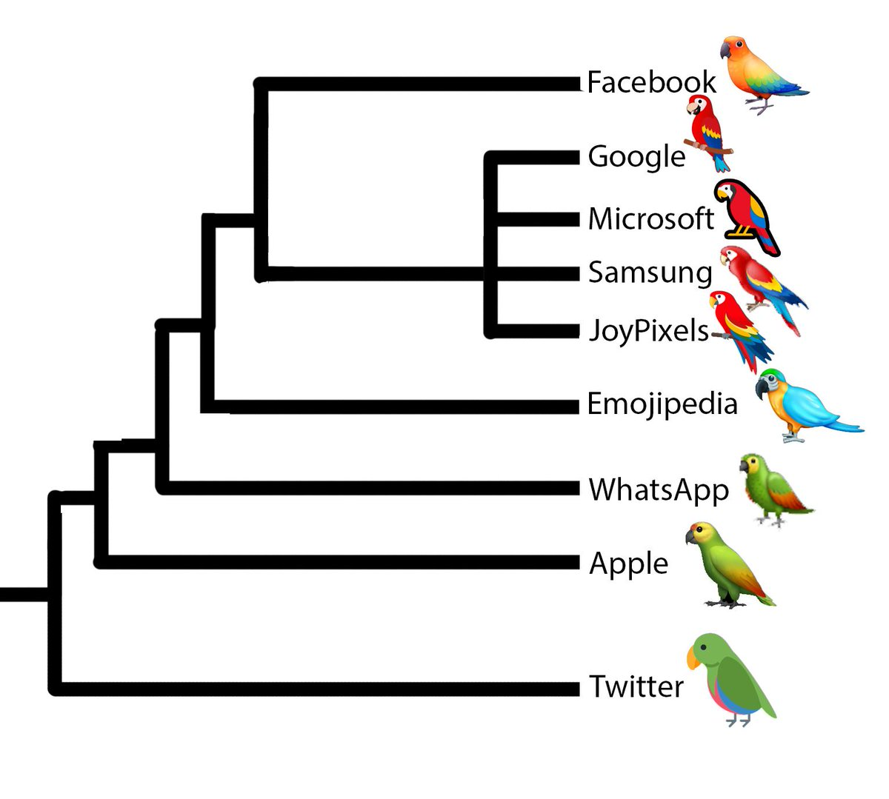

<!-- .slide: data-background="#134EA2" -->

##  Phylogenetic Software     in Haskell 

 Alex Washburn, Callan McGill   
 Ward Wheeler 

---

### What we'll be covering:

 * What is phylogenetics?

 * Who are the users?

 * How we organize a large scale Haskell project?

 * Challenges of Haskell?

---

### What is phylogenetics?

 The phylogenetic tree of emoji parrots 

----

 *   <b> Taxon set </b> :  emoji parrots
  

   
     <i> More generally: </i> Groups of organisms
     , languages etc.
   
  

 *  <b> Character observations </b> :   colour of feathers

   
     <i>More generally: </i> Other morphological characteristics
     , DNA characters etc.
   
  

 *  <b> Binary tree </b> :    hypothesized evolutionary tree of emoji parrots. 

   
   The <i> "best" </i> (see next slide) tree 
   to explain the relationships between this data. 
   
  

---

### What is parsimony?

 * Occam's razor

 * Optimality criterion

Note: 
Occam's razor, which states that—all else being equal—the simplest hypothesis that explains the data should be selected

Note: 
Minimizes the total number of character-state changes is to be preferred

---

### What is tree space?

 * Tree Alignment Problem

---

### Phylogenetic Component Graphs (PCG)

 * Arbitrary taxa, not just organisms

 * Abstract characters, not just biological observations

 * Networks, not just binary trees

---

### Why Haskell?

 * Parellelism

 * Expressivity

 * Correctness

---

### Phylogenetic user story

 * Define taxa

 * Collect & colate character observations

 * Define your search parameters

 * Start your search

---

### Mechanically that looks like

 * Create a lot of large files

 * Set a lot of configuration options

 * Wait a very long time

---

### Scientists are expert users

 * Identify definate or potential issues

 * Collect and colate all issues

 * Suggest holistic solutions

---

### Challenges

<section>
	<pre><code data-trim data-noescape>
data Graph = Vector (IndexData e n)
	</code></pre>
</section>
